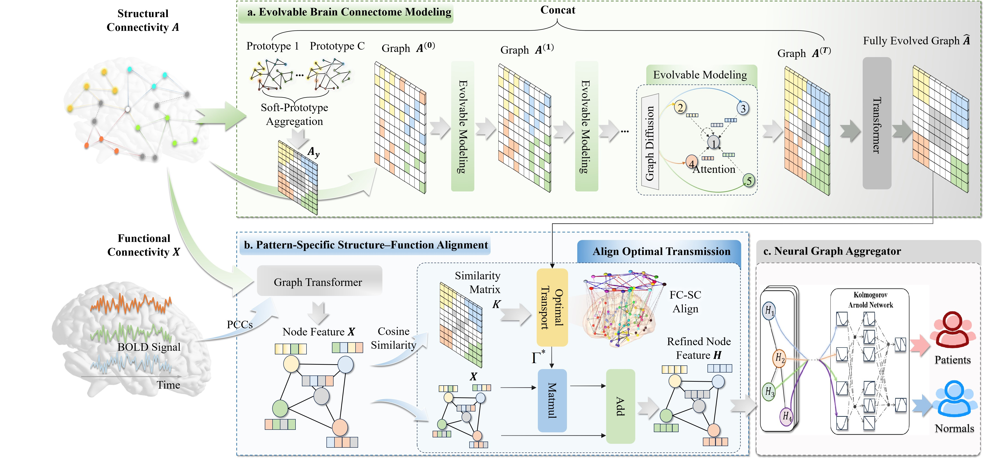
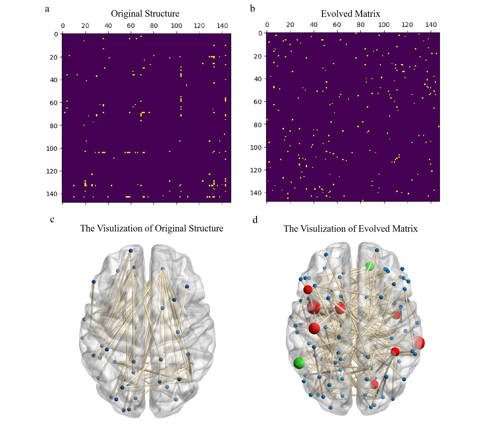
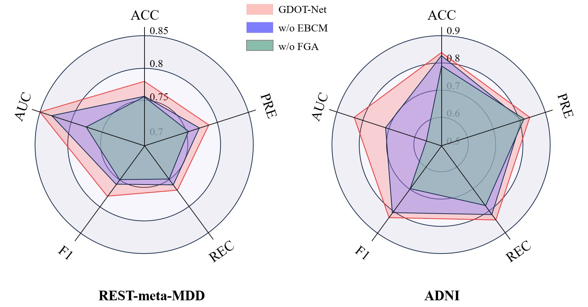

# GDOT-Net: Modeling Multi-Modal Brain Connectome for Brain Disorder Diagnosis via Graph Diffusion Optimal Transport Network

###  :eyes: This work is under review at Recomb 2026.




# How to run this code

All of the following operations must be entered in the operating system's command line. 

## Get project

```
git clone git@github.com:liujiawen-jpg/GDOT-Net.git
```

## Environment install

### It is recommended to use Python 3.12.x to avoid ImportError

```
# Necessary environment requirements
pip install -r requirements.txt
```
GDOT-Net requires the rational_kat library. You can find the installation instructions here: https://github.com/Adamdad/rational_kat_cu.

## How to run the code!!!!

:eyes:  You can see the toy_example.ipynb.:eyes:

# Experiments






## Notion

If there are any problems, please don't hesitate to contact us by email: [a2080463892@gmail.com]

